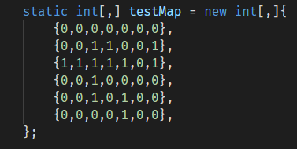

# Поиск пути в лабиринте методом волновой трассировки (методом Ли) на C#

[Описание алгоритма на википедии](https://ru.wikipedia.org/wiki/%D0%90%D0%BB%D0%B3%D0%BE%D1%80%D0%B8%D1%82%D0%BC_%D0%9B%D0%B8)

## Что умеет реализация

На вход даём координаты стартовой точки и конечной точки, а также int'овый массив, где 1 - стена, 0 - свободное пространство.

На выход получаем путь от начальной до конечной точки в виде массива координат. Путь получается кратчайшим, хотя не обязательно очевидным и прямым.

Реализация умеет искать путь и с учётом диагоналей:

Если координаты вышли за границу лабиринта - получаем exception.

Если пути между точками нет или одна из точек занята стеной - возвращает пустой массив.
